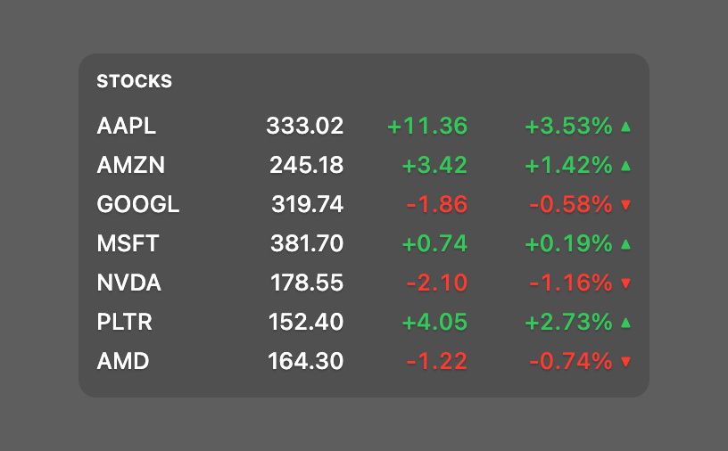

# Stocks

[](https://creativecommons.org/licenses/by-nc/4.0/)

A compact stock and crypto ticker for [Übersicht](http://tracesof.net/uebersicht/). It lists each symbol's price and the day's change from Yahoo Finance (no API key required), refreshed on a timer. Gains and losses use the theme's green/red with ▲/▼ arrows, and clicking a row opens that symbol on Yahoo Finance. Colors are theme-aware, with sensible built-in defaults, so the widget works on its own.

## Screenshot



## Symbols

Edit the comma-separated list at the top of `stocks.widget/lib/stocks.sh`:

```bash
SYMBOLS="AAPL,AMZN,GOOGL,MSFT,NVDA,PLTR,AMD"
```

Any Yahoo Finance symbol works: stocks (`AAPL`), indexes (`^GSPC`), FX pairs (`EURUSD=X`), and crypto (`BTC-USD`). The widget shows one row per symbol, in the order listed.

## Data source

Quotes come from Yahoo Finance's v7 quote endpoint. A bare request now returns `401 Unauthorized`, so `lib/stocks.sh` does Yahoo's cookie + "crumb" handshake first (grab a session cookie, exchange it for a crumb), then makes a single batch request for all symbols. No API key, and nothing to install: the JSON is parsed with the system `python3`.

## Options

At the top of `index.coffee`:

```coffeescript
  # How often to refresh the quotes. Written as <minutes> * 60 * 1000, so edit the
  # leading number to set the interval in minutes.
  refreshFrequency: 15 * 60 * 1000   # 15 minutes
```

## How the links open

Übersicht's WebView doesn't route `target="_blank"` to the browser, and classic widgets have no `run` global. Instead, clicking a row POSTs `open '<url>'` to Übersicht's local `/run/` endpoint (a same-origin request, which the endpoint allows), opening the symbol on Yahoo Finance in your default browser. This works out of the box with no extra configuration.

## Installation

- Download the [repository](https://github.com/dionmunk/uebersicht-stocks/archive/master.zip) and extract it.
- Place the `stocks.widget` folder in your Übersicht extension folder.
- Edit `lib/stocks.sh` to set your symbols.
- Refresh Übersicht.

## Theming

This widget is theme-aware. Its colors come from CSS custom properties (text, panel tint, and the green/red for gains and losses) with sensible built-in fallbacks, so it looks right on its own. Install the [Theme Controller](https://github.com/dionmunk/uebersicht-theme-controller) widget and this one automatically follows its color scheme and light/dark mode, staying in sync with the rest of the collection.

## Credits

Originally inspired by [veeranagouda/StockTickerWidget](https://github.com/veeranagouda/StockTickerWidget); rewritten for the current Yahoo Finance API and the shared widget format.

## Layout

This widget is layout-aware. Its size comes from CSS custom properties published by the [Layout Controller](https://github.com/dionmunk/uebersicht-layout-controller) widget (column width, base row height, and gap), with its own fixed values as fallbacks, so it sizes correctly on its own. Install the Layout Controller and you can drag this widget anywhere on the desktop, snap it into a column, and have it stay where you put it across reloads and restarts.

## License

This work is licensed under a [Creative Commons Attribution-NonCommercial 4.0 International License](https://creativecommons.org/licenses/by-nc/4.0/).
